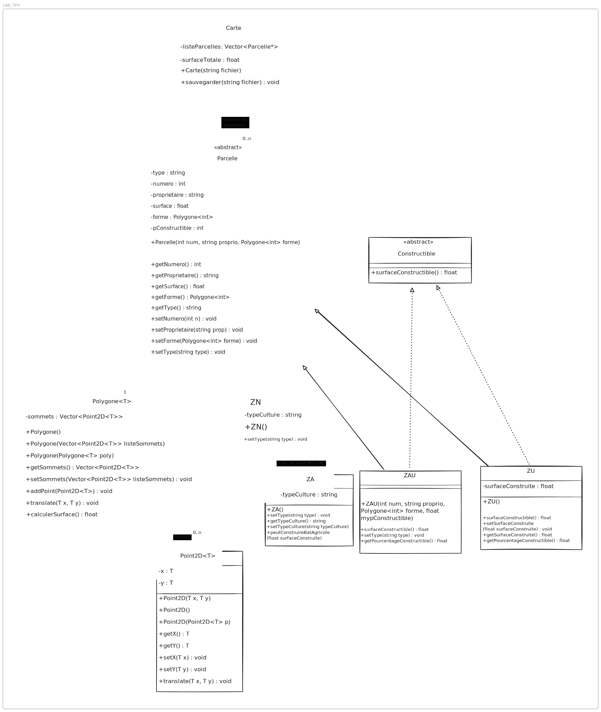

# TP4 - TP PLU noté

SEC 2

- Eloi Tourangin - <eloi.tourangin@eleves.ec-nantes.fr>
- Lucas Oros - <lucas.oros@eleves.ec-nantes.fr>
- Djamael Lahamion - <djamael.lahamion@eleves.ec-nantes.fr> (/!\ /!\ pas de PC pour ce TP /!\ /!\)
- Aloïs Guillon - <alois.guillon@eleves.ec-nantes.fr>

# Organisation du groupe

## Répartition initiale — Cours 1

Chaque membre a reçu une partie du projet à réaliser :

- **Aloïs & Djamaël** : classe `Point2D`
- **Lucas** : classe `Polygone`
- **Eloi** : classe `Parcelle`
- **Aloïs & Djamaël** : classe `ZAU`
- **Eloi** : classe `Constructible`

**Objectif atteint :** toutes les classes prévues pour le premier cours ont été terminées.

---

## Répartition — Cours 2

- **Eloi** : classe `Carte`
- **Lucas & Djamaël** : classes `ZA`, `ZN`, `ZU`

---

## 📌 Bonus & Finalisation

- **Djamaël** : réalisation du **Bonus 1**
- **Lucas** : rédaction et organisation des **tests dans le `main`**

## Table des matières

1. [Compilation et Exécution](#compilation-et-exécution)
2. [Diagramme des classes](#diagramme-des-classes)
3. [Description des classes](#description-des-classes)
4. [Concepts Clés](#concepts-clés)

## Compilation et Exécution

### Méthode 1 : Utiliser make

\\\ash
# Compiler
make

# Exécuter
./build/main.out
\\\

### Méthode 2 : Utiliser le script bash

\\\ash
./build_and_execute.sh
\\\

---

## Diagramme des classes

## Description des classes

### Classe Point2D

#### Description

La classe Point2D est une template représentant un point dans le plan cartésien défini par deux coordonnées x et y. Elle fournit les opérations élémentaires pour accéder et modifier ces coordonnées, ainsi qu'une translation du point. Cette classe sert de brique de base pour la définition des sommets des polygones et supporte l'affichage via la surcharge de l'opérateur <<.

#### Méthodes

| Méthode | Description |
|---------|-------------|
| getX() | Retourne la coordonnée x du point. |
| getY() | Retourne la coordonnée y du point. |
| setX(T x) | Définit la coordonnée x du point. |
| setY(T y) | Définit la coordonnée y du point. |
| translate(T dx, T dy) | Effectue une translation du point en ajoutant dx à x et dy à y. |
| friend ostream& operator<<(ostream& os, const Point2D\<T\>& point) | Surcharge de l'opérateur << pour afficher le point au format [x;y]. |

#### Tests

Pas de test nécessaire

#### Gestion des Exceptions

La classe Point2D lève des exceptions en cas d'erreur lors de l'initialisation ou de la copie d'objets. Les constructeurs utilisent des try-catch pour capturer les erreurs et lèvent des exceptions \invalid_argument\ ou \
untime_error\ avec des messages descriptifs en cas de problème lors de l'assignation des coordonnées.

---

### Classe Polygone

#### Description de Polygone

La classe Polygone représente une figure géométrique définie par une série de sommets dans un espace bidimensionnel. Chaque sommet est représenté par un objet de la classe point2d, qui stocke les coordonnées x et y du point. La classe Polygone permet de créer des polygones en fournissant une liste de sommets, de copier des polygones existants, de manipuler les sommets du polygone et de calculer la surface d'un polygone. Elle offre des méthodes pour obtenir et définir la liste des sommets, ajouter de nouveaux sommets, et effectuer des translations sur l'ensemble du polygone en déplaçant tous ses sommets d'un certain décalage en x et y.

#### Méthodes de Polygone

| Méthode | Description |
|---------|-------------|
| getSommets() | Retourne la liste des sommets du polygone. |
| setSommets(listeSommets) | Définit la liste des sommets du polygone. |
| addPoint(p) | Ajoute un nouveau sommet au polygone. |
| translate(dx, dy) | Effectue une translation du polygone en déplaçant tous ses sommets. |
| calculerSurface() | Calcule et retourne la surface du polygone en utilisant la formule du shoelace. |
| friend ostream& operator<<(ostream& os, const Polygone\<T\>& poly) | Surcharge de l'opérateur << pour afficher tous les sommets du polygone. |

#### Explication des choix faits pour la classe Polygone

- calculerSurface : Nous avons choisi d'implémenter le calcul de la surface d'un polygone directement dans la classe Polygone. Nous aurions pu créer une méthode dans la classe Parcelle qui récupère la liste des sommets et effectue ce calcul, mais nous avons jugé plus logique de le mettre en place dans Polygone, étant donné que la surface est une propriété intrinsèque du polygone.

#### Tests de Polygone

Dans ce test, nous créons un polygone en utilisant une liste de sommets définis par des objets point2d. Nous affichons les sommets du polygone initial, puis nous créons une copie du polygone en utilisant le constructeur de recopie. Nous affichons les sommets du polygone copié pour vérifier qu'ils correspondent à ceux de l'original. Ensuite, nous appliquons une translation au polygone copié et affichons ses nouveaux sommets pour confirmer que la translation a été effectuée correctement. Enfin, nous vérifions que le polygone original n'a pas été modifié après la translation du polygone copié, assurant ainsi l'intégrité des données. Nous terminons par calculer la surface d'un polygone avec 5 sommets.

#### Gestion des Exceptions

La classe Polygone effectue plusieurs validations :
- **Nombre de sommets** : Lève une exception \invalid_argument\ si le polygone possède moins de 3 sommets (un polygone valide doit en avoir au moins 3).
- **Sens trigonométrique** : Vérifie que les sommets sont ordonnés dans le sens trigonométrique (antihoraire). Si ce n'est pas le cas, une exception \invalid_argument\ est levée lors de la construction ou de la modification via \setSommets\.
- **Opérations supplémentaires** : Les méthodes \ddPoint\, \	ranslate\, \calculerSurface\ et \getSommets\ enveloppent leurs opérations dans des try-catch pour capturer et relancer des exceptions avec des messages contextualisés.

---

### Classe Parcelle

#### Description de Parcelle

La classe Parcelle modélise une unité foncière du cadastre. Chaque parcelle possède un numéro, un propriétaire, une forme géométrique décrite par un Polygone\<int\>, une surface calculée automatiquement, un pourcentage constructible et un type. C'est une classe abstraite, car elle impose l'implémentation de la méthode setType() par ses sous-classes. Elle assure la validation des données (surface strictement positive) et permet l'affichage détaillé des informations d'une parcelle

#### Méthodes de Parcelle

| Méthode | Description |
|---------|-------------|
| getNumero() | Retourne le numéro de la parcelle. |
| getProprietaire() | Retourne le propriétaire de la parcelle. |
| getSurface() | Retourne la surface de la parcelle. |
| getForme() | Retourne la forme géométrique de la parcelle. |
| getType() | Retourne le type de la parcelle. |
| setNumero(num) | Définit le numéro de la parcelle. |
| setProprietaire(proprio) | Définit le propriétaire de la parcelle. |
| setForme(forme) | Définit la forme géométrique de la parcelle. |
| setType(type) | Méthode virtuelle pure à implémenter par les sous-classes. |
| friend ostream& operator<<(ostream& os, const Parcelle& p) | Surcharge de l'opérateur << pour afficher les informations d'une parcelle. |

#### Tests de Parcelle

Pas de test possible

#### Gestion des Exceptions

La classe Parcelle valide les données au moment de la construction et lors des modifications :
- **Numéro de parcelle** : Les constructeurs et la méthode \setNumero()\ vérifient que le numéro est strictement positif (> 0). Une exception \invalid_argument\ est levée sinon.
- **Propriétaire** : Les constructeurs et la méthode \setProprietaire()\ s'assurent que le propriétaire n'est pas une chaîne vide. Une exception \invalid_argument\ est levée en cas de chaîne vide.
- **Forme géométrique** : La méthode \setForme()\ valide que le polygone fourni possède au moins 3 sommets, levant une exception \invalid_argument\ si ce n'est pas le cas.

---

### Classe Constructible

#### Description de Constructible

La classe abstraite Constructible représente une parcelle sur laquelle une construction est possible. Elle ajoute une méthode virtuelle pure surfaceConstructible() que les classes dérivées doivent implémenter afin de calculer la surface effectivement constructible selon les règles du PLU.

#### Méthodes de Constructible

| Méthode | Description |
|---------|-------------|
| surfaceConstructible() | Méthode virtuelle pure retournant la surface constructible selon les règles du PLU. |

#### Tests de Constructible

Pas de test possible

#### Gestion des Exceptions

La classe Constructible est abstraite et ne possède pas de méthode concrète. Cependant, les exceptions levées par les classes Parcelle (classe parente) et Constructible (interface) se propagent vers les classes dérivées (ZU, ZAU, Za). Les exceptions sont gérées au niveau de ces classes dérivées qui héritent des validations de Parcelle.

---

### Classe zu

#### Description de zu

La classe ZU décrit une parcelle en zone urbaine. Elle est constructible et possède en plus une surface déjà construite. Sa méthode surfaceConstructible() renvoie la surface encore disponible pour la construction, en tenant compte du pourcentage constructible et de la surface déjà bâtie. L'affichage mentionne explicitement qu'il s'agit d'une ZU.

#### Méthodes de zu

| Méthode | Description |
|---------|-------------|
| setSurfaceConstruite(surfaceConstruite) | Définit la surface déjà construite de la parcelle. |
| getSurfaceConstruite() | Retourne la surface déjà construite de la parcelle. |
| surfaceConstructible() | Retourne la surface encore disponible pour la construction (surface * % - surface déjà construite). |
| getPourcentageConstructible() | Retourne le pourcentage constructible de la parcelle. |
| friend ostream& operator<<(ostream& os, const Zu& zu) | Surcharge de l'opérateur << pour afficher les informations d'une ZU. |

#### Tests de zu

Ce test vérifie le bon fonctionnement d'une parcelle de type ZU (Zone Urbaine), notamment la gestion de sa surface construite et de sa surface constructible restante.
Une parcelle n°43 est créée avec un polygone rectangulaire simple, permettant de valider le calcul automatique de la surface (12 m²). Le pourcentage constructible fixé à 15 % est appliqué pour déterminer la surface maximale autorisée.
On attribue ensuite une surface déjà construite (0,448686 m²), puis le test affiche la surface encore disponible pour la construction.
L'ensemble permet de confirmer :

- le calcul correct de la surface géométrique,
- la prise en compte du pourcentage constructible,
- le calcul de la surface restante disponible,
- l'affichage complet et cohérent des informations propres à une ZU.

#### Gestion des Exceptions

La classe ZU hérite de Parcelle et bénéficie de sa validation. Les exceptions suivantes peuvent être levées :
- **Numéro invalide** : Une exception \invalid_argument\ est levée si le numéro  0 lors de la construction.
- **Propriétaire vide** : Une exception \invalid_argument\ est levée si le propriétaire est une chaîne vide lors de la construction.
- **Polygone invalide** : Une exception \invalid_argument\ est levée si le polygone a moins de 3 sommets ou n'est pas dans le sens trigonométrique.
Ces validations s'effectuent lors du constructeur et lors des appels à \setNumero()\, \setProprietaire()\ et \setForme()\.

---

### Classe zau

#### Description de zau

La classe ZAU représente une zone à urbaniser. Elle est également constructible mais ne possède pas de surface construite initiale. La surface constructible correspond à la proportion autorisée par le PLU appliquée à la surface totale. L'affichage la distingue clairement comme ZAU.

#### Méthodes de zau

| Méthode | Description |
|---------|-------------|
| surfaceConstructible() | Retourne la surface totale disponible pour l'urbanisation (surface * %). |
| getPourcentageConstructible() | Retourne le pourcentage constructible de la parcelle. |
| friend ostream& operator<<(ostream& os, const Zau& zau) | Surcharge de l'opérateur << pour afficher les informations d'une ZAU. |

#### Tests de zau

Ce test valide le comportement d'une parcelle de type ZAU (Zone à Urbaniser), dont la surface constructible correspond uniquement au pourcentage autorisé, puisqu'aucune surface n'est déjà bâtie dans ce type de zone.
La parcelle n°14 est définie à partir d'un polygone triangulaire simple, ce qui permet de vérifier correctement le calcul automatique de la surface (6 m²).
Le pourcentage constructible fixé à 11 % est ensuite appliqué pour déduire la surface totale disponible pour la future urbanisation.
Le test permet ainsi de confirmer :

- le calcul correct de la surface géométrique,
- la prise en compte du pourcentage constructible propre aux ZAU,
- l'affichage cohérent des informations spécifiques au type ZAU.

#### Gestion des Exceptions

La classe ZAU hérite de Parcelle et applique les mêmes validations :
- **Numéro invalide** : Une exception \invalid_argument\ est levée si le numéro  0 lors de la construction.
- **Propriétaire vide** : Une exception \invalid_argument\ est levée si le propriétaire est une chaîne vide lors de la construction.
- **Polygone invalide** : Une exception \invalid_argument\ est levée si le polygone a moins de 3 sommets ou n'est pas dans le sens trigonométrique.
Ces validations s'effectuent lors du constructeur et lors des appels à \setNumero()\, \setProprietaire()\ et \setForme()\.

---

### Classe zn

#### Description de zn

La classe ZN représente une zone naturelle ou forestière. Elle n'est pas constructible. L'affichage indique explicitement son statut de zone non constructible.

#### Méthodes de zn

| Méthode | Description |
|---------|-------------|
| setType(type) | Définit le type de la parcelle à "ZN". |

#### Tests de zn

Ce test vérifie le comportement d'une parcelle de type ZN (Zone Naturelle), zone dans laquelle aucune construction n'est autorisée.
La parcelle n°67 est définie à partir d'un polygone rectangulaire, permettant de valider le calcul automatique de la surface (58 m²).
L'objectif du test est principalement de s'assurer que :

- la surface est correctement calculée à partir des sommets fournis,
- le type ZN est correctement identifié et affiché,
- aucune information relative à la constructibilité n'apparaît, conformément au statut non constructible des ZN.
- Ce test confirme ainsi le comportement attendu d'une parcelle naturelle dans le cadre du PLU.

#### Gestion des Exceptions

La classe ZN hérite de Parcelle et applique les mêmes validations :
- **Numéro invalide** : Une exception \invalid_argument\ est levée si le numéro  0 lors de la construction.
- **Propriétaire vide** : Une exception \invalid_argument\ est levée si le propriétaire est une chaîne vide lors de la construction.
- **Polygone invalide** : Une exception \invalid_argument\ est levée si le polygone a moins de 3 sommets ou n'est pas dans le sens trigonométrique.
Ces validations s'effectuent lors du constructeur et lors des appels à \setNumero()\, \setProprietaire()\ et \setForme()\.

---

### Classe za

#### Description de za

La classe ZA décrit une zone agricole, dérivant d'une ZN mais avec un type de culture associé. Elle n'est généralement pas constructible, sauf pour des bâtiments agricoles sous contraintes strictes (10 % de la surface et 200 m²). La méthode surfaceConstructible() applique ces règles spécifiques. L'affichage inclut le type de culture.

#### Méthodes de za

| Méthode | Description |
|---------|-------------|
| getTypeCulture() | Retourne le type de culture de la parcelle agricole. |
| setTypeCulture(typeCulture) | Définit le type de culture de la parcelle agricole. |
| setType(type) | Définit le type de la parcelle à "ZA". |
| peutConstruireBatAgricole(surfaceConstruite) | Vérifie et affiche si une construction de bâtiment agricole est possible selon les règles du PLU. |
| friend ostream& operator<<(ostream& os, const Za& za) | Surcharge de l'opérateur << pour afficher les informations d'une ZA. |

#### Tests de za

Ce test évalue le fonctionnement d'une parcelle de type ZA (Zone Agricole), caractérisée par l'ajout d'un type de culture et par un régime spécifique de constructibilité très limité.
La parcelle n°92 est définie à partir d'un polygone rectangulaire afin de valider le calcul automatique de la surface (75 m²). Le test vérifie également la bonne prise en compte de l'attribut supplémentaire propre aux ZA : ici, la culture déclarée est Céréales.
L'objectif est de confirmer que :

- la surface est correctement calculée,
- le type ZA est identifié et affiché correctement,
- les informations agricoles spécifiques sont bien intégrées,
- aucune surface constructible n'est indiquée (sauf règles particulières pour bâtiments agricoles, non sollicitées dans ce test).
- Ce test assure ainsi la conformité de l'implémentation d'une zone agricole dans le PLU.

#### Gestion des Exceptions

La classe ZA hérite de Parcelle et applique les mêmes validations :
- **Numéro invalide** : Une exception \invalid_argument\ est levée si le numéro  0 lors de la construction.
- **Propriétaire vide** : Une exception \invalid_argument\ est levée si le propriétaire est une chaîne vide lors de la construction.
- **Polygone invalide** : Une exception \invalid_argument\ est levée si le polygone a moins de 3 sommets ou n'est pas dans le sens trigonométrique.
Ces validations s'effectuent lors du constructeur et lors des appels à \setNumero()\, \setProprietaire()\ et \setForme()\.

---

### Classe carte

#### Description de carte

La classe Carte regroupe un ensemble de parcelles et gère la surface totale représentée. Elle permet de construire une carte à partir d'un fichier de description, en interprétant automatiquement les différents types de parcelles. Elle offre également la fonctionnalité de sauvegarde dans un fichier au même format. Cette classe constitue le niveau global d'organisation du cadastre.

#### Méthodes de carte

| Méthode | Description |
|---------|-------------|
| carte(pathToFile) | Constructeur chargeant les parcelles depuis un fichier. |
| sauvegarder(pathToFile) | Méthode permettant de sauvegarder la carte dans un fichier au même format. |

#### Tests de carte

Ce test valide le bon fonctionnement complet du projet en chargeant un fichier cadastral et en affichant toutes les parcelles qu'il contient. Les tests permettent de vérifier que le chargement interprète correctement les différents types de parcelles (ZU, ZAU, ZN, ZA) ainsi que leurs propriétés spécifiques.

#### Gestion des Exceptions

La classe Carte gère les exceptions au moment du chargement et de la sauvegarde des fichiers :
- **Fichier d'entrée** : Si le fichier spécifié n'existe pas ou ne peut pas être ouvert, une exception \
untime_error\ est levée avec un message descriptif.
- **Validation du type de parcelle** : Si un type de parcelle invalide est rencontré dans le fichier, une exception \invalid_argument\ est levée.
- **Propagation des exceptions** : Les exceptions levées par les constructeurs des parcelles (validations de numéro, propriétaire, polygone) sont capturées et relancées comme \
untime_error\ avec un contexte enrichi. La mémoire allouée est correctement libérée en cas d'erreur pour éviter les fuites.
- **Fichier de sortie** : Si le fichier de sauvegarde ne peut pas être ouvert en écriture, une exception \
untime_error\ est levée.
- **Pointeurs null** : Pendant la sauvegarde, une exception \logic_error\ est levée si un pointeur de parcelle est null ou si un cast dynamique échoue.
- **Erreurs d'I/O** : Les erreurs lors de l'écriture dans le fichier sont capturées et converties en \
untime_error\.

---

## Concepts Clés

- **Héritage multiple** : Les classes ZU et ZAU héritent à la fois de Constructible et de Parcelle pour implémenter les comportements spécifiques aux zones constructibles.
- **Classes abstraites** : Parcelle et Constructible définissent des interfaces virtuelles pures que leurs classes dérivées doivent implémenter.
- **Templates** : Les classes Point2D et Polygone sont des templates pour supporter différents types de coordonnées (int, float, double).
- **Gestion du cadastre** : La classe Carte agrège l'ensemble des parcelles et gère leur persistance via des fichiers.
